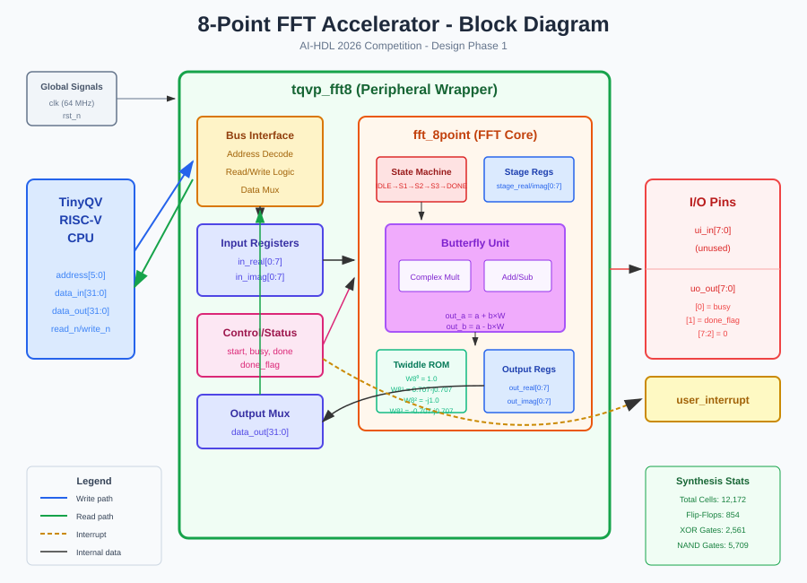
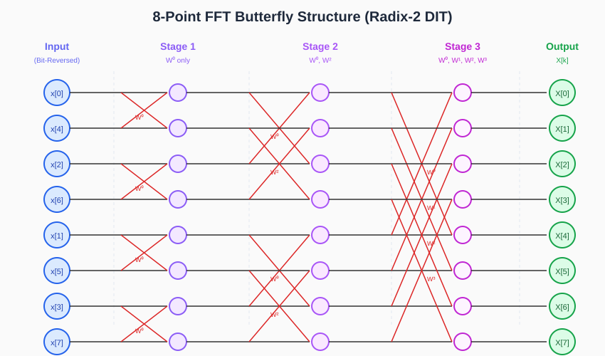

# AI-HDL 2026 - 8-Point FFT Accelerator

**Team:** Devrem </br>
**Team Members:** <a href="https://www.linkedin.com/in/bhangun/" target="Batuhan Hangün">Batuhan Hangün</a> ,
                  <a href="https://www.linkedin.com/in/safak-sahin/" target="Şafak Şahin">Şafak Şahin</a> </br>
**Competition:** AI-HDL 2026 Design Competition  
**Phase:** Design Phase 4 (DP4) — Netlist to Chip Tapeout

## Project Overview

This project implements an **8-Point FFT (Fast Fourier Transform) Accelerator** as a peripheral for the TinyQV RISC-V core. The design uses a Radix-2 Decimation-in-Time algorithm with fixed-point arithmetic.

## Architecture

### Block Diagram

The FFT accelerator integrates with the TinyQV RISC-V CPU through a memory-mapped peripheral interface:



### Butterfly Structure

The 8-point FFT is computed using a 3-stage Radix-2 DIT (Decimation-in-Time) butterfly network:



**Key Algorithm Details:**

- **Stage 1:** 4 butterflies with W⁰ twiddle factor (distance 1)
- **Stage 2:** 4 butterflies with W⁰, W² twiddle factors (distance 2)
- **Stage 3:** 4 butterflies with W⁰, W¹, W², W³ twiddle factors (distance 4)
- **Bit-reversal:** Input samples are reordered (0,4,2,6,1,5,3,7) for in-place computation

## Features

- 8-point complex FFT computation
- 16-bit signed fixed-point arithmetic (Q1.15 format)
- Memory-mapped register interface
- Interrupt on completion
- **[DP2]** 2-stage pipelined butterfly for improved Fmax
- **[DP2]** Clock gating on stage/output/input registers
- **[DP2]** Operand isolation to eliminate idle switching
- **[DP2]** Trivial twiddle (W⁰) bypass — skips multiply for 67% of butterflies
- **[DP2]** Enhanced synthesis flow (flatten + resource sharing)
- **[DP3]** SPI lock (CM-A) — one-time-writable LOCK bit disables SPI test harness in production
- **[DP3]** Input register zeroization on FFT completion (CM-B) — prevents sample leakage
- **[DP3]** Interrupt-clear decoupled from start (CM-C) — CONTROL[1] standalone ACK
- **[DP3]** Write-error sticky flag (CM-D) — STATUS[2] surfaces rejected writes
- **[DP3]** Butterfly overflow saturation (CM-E) — 17-bit arithmetic with clamp
- **[DP3]** FSM hardening and deadlock fix (CM-F) — busy-in-IDLE eliminated
- **[DP3]** Stage register reset initialization (CM-G) — CWE-1271 addressed
- **[DP3]** Input register read-back removed (CM-H) — write-only semantics enforced
- **[DP3]** Output pins masked in production mode (CM-I) — FSM state not exposed on uo_out

## PPA Summary (DP1 / DP2 / DP3)

| Metric | DP1 Baseline | DP2 Optimized | DP3 Hardened |
|--------|-------------|---------------|--------------|
| Total Cells | 12,172 | 10,731 | **11,396** |
| Flip-Flops | 854 | 923 | **925** |
| Latency | ~15 cycles | ~28 cycles | ~28 cycles |
| Critical Path | Full multiply chain | Pipelined | Pipelined + CM-E clamp |
| Synthesis Errors | 0 | 0 | **0** |
| Security Tests | — | — | **11 / 11 PASS** |

Full analysis: `docs/PPA_IMPACT_ANALYSIS.md`

## DP4: Physical Design (Tapeout)

Design Phase 4 takes the DP3-hardened RTL through the full OpenLane ASIC flow:

**Synthesis** -> **Floorplan** -> **Placement** -> **CTS** -> **Routing** -> **STA/DRC/LVS Sign-off** -> **GDSII**

| Parameter | Value |
|-----------|-------|
| Technology | SkyWater 130nm (sky130) |
| Tile Size | 1x2 Tiny Tapeout (~167x216 um) |
| Target Clock | 71.5 MHz (14 ns period) |
| Target Density | 70% |
| Max Metal Layer | met4 |

See `docs/DP4_OPENLANE_INSTRUCTIONS.md` for build instructions.
See `docs/DP4_FINAL_PROJECT_REPORT.md` for the comprehensive project report (DP1-DP4).

## File Structure

```text
├── src/
│   ├── fft_8point.v       # FFT core + pipelined butterfly (DP2/DP3: CM-B,E,F,G)
│   ├── peripheral.v       # TinyQV bus interface (DP2/DP3: CM-A,B,C,D,H,I)
│   ├── fft_8point_tb.v    # Functional testbench (DP1)
│   ├── security_tb.v      # Security regression testbench (DP3, 11 checks)
│   ├── tt_wrapper.v       # TinyTapeout wrapper (DP3: CM-A SPI lock gate)
│   ├── config.json        # OpenLane configuration (DP4)
│   ├── synth.ys           # Yosys synthesis script (DP2: enhanced)
│   └── test_harness/      # SPI test infrastructure
├── docs/
│   ├── DESIGN_REPORT.md              # DP1 design write-up
│   ├── DP2_OPTIMIZATION_REPORT.md    # DP2 before-and-after comparison
│   ├── ATTACK_SURFACE_MAP.md         # DP3 threat surface analysis
│   ├── CIA_ANALYSIS.md               # DP3 confidentiality/integrity/availability
│   ├── STRIDE_ANALYSIS.md            # DP3 18-threat STRIDE catalogue
│   ├── DREAD_SCORES.md               # DP3 quantitative risk ranking
│   ├── CWE_FINDINGS.md               # DP3 hardware CWE evaluation (9 CWEs)
│   ├── MITIGATION_PLAN.md            # DP3 countermeasure design (CM-A…CM-I)
│   ├── REGRESSION_RESULTS.md         # DP3 simulation + synthesis results
│   ├── SECURITY_VALIDATION_RESULTS.md# DP3 per-check security test results
│   ├── PPA_IMPACT_ANALYSIS.md        # DP1/DP2/DP3 PPA comparison
│   ├── DP3_SECURITY_REPORT.md        # DP3 final submission report
│   ├── DP4_FINAL_PROJECT_REPORT.md   # DP4 comprehensive final report (DP1-DP4)
│   ├── DP4_OPENLANE_INSTRUCTIONS.md  # OpenLane run instructions for colleague
│   ├── LLM_PROMPT_LOG.md             # AI prompt history
│   └── info.md                       # Quick reference
├── fft_block_diagram.svg  # Architecture block diagram
├── fft_butterfly_flow.svg # Butterfly structure diagram
├── info.yaml              # Tiny Tapeout project metadata
├── synthesis_report.txt   # DP1 Yosys synthesis output
├── synthesis_report_dp2.txt # DP2 Yosys synthesis output
└── README.md
```

## Verification

**Functional regression (DP1 testbench — all 3 checked tests pass):**

- DC Signal test — PASS
- Impulse test — PASS
- Nyquist frequency test — PASS

**Security regression (DP3 testbench — 11/11 checks pass):**

- Write protection (CM-D): 3/3
- Computation integrity (CM-B): 1/1
- Data leakage prevention (CM-B, CM-H): 2/2
- FSM robustness (CM-F, CM-G): 2/2
- Debug lockout (CM-A, CM-I): 3/3

**Run functional tests:**

```bash
cd src/
iverilog -o fft_test fft_8point.v peripheral.v fft_8point_tb.v
vvp fft_test
```

**Run security tests:**

```bash
cd src/
iverilog -o sec_test fft_8point.v peripheral.v tt_wrapper.v security_tb.v
vvp sec_test
```

**Run synthesis:**

```bash
cd src/
yosys synth.ys 2>&1 | tee ../synthesis_report_dp3.txt
```

## Tools Used

- **HDL Generation:** Claude (Anthropic)
- **Simulation:** Icarus Verilog
- **Synthesis:** Yosys
- **Physical Design:** OpenLane 2 (sky130 PDK)
- **Waveform Viewer:** GTKWave

## Register Map

| Address | Name | Description |
|---------|------|-------------|
| 0x00-0x1C | INPUT_REAL[0-7] | Real input samples |
| 0x20-0x3C | INPUT_IMAG[0-7] | Imaginary input samples |
| 0x40 | CONTROL | [0]=start_fft [1]=int_clear [2]=spi_lock [3]=err_clear |
| 0x44 | STATUS | [0]=busy [1]=done [2]=write_error (read-only) |
| 0x48-0x64 | OUTPUT_REAL[0-7] | Real output |
| 0x68-0x84 | OUTPUT_IMAG[0-7] | Imaginary output |

## License

Apache 2.0
